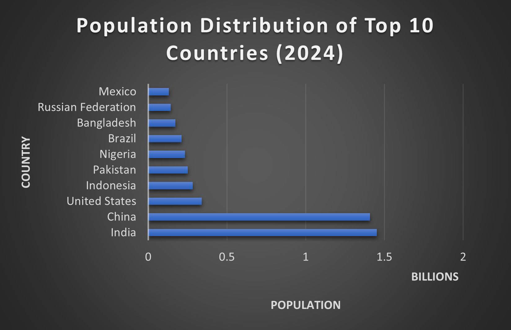

# Prodigy Infotech – Data Science Internship
## Task 1: Population Distribution Visualization

### 📌 Objective
To create a bar chart to visualize the distribution of a continuous variable using a real-world dataset.

### 📊 Dataset
- World Bank Population Dataset
- File: API_SP.POP.TOTL_DS2_en_csv_v2_34.csv

### 🛠 Tools Used
- MS Excel

### 📈 Visualization
A bar chart showing the population distribution of the top 10 most populous countries in 2024.

### 🧠 Conclusion
The visualization clearly compares population sizes across countries and helps in understanding global population distribution.

### 📷 Bar Chart Output

